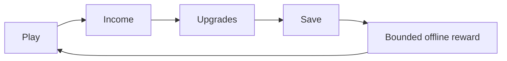

# KBBQ Idle Unity

A Unity idle-management prototype with economy progression, offline earnings, save-state systems and a separate backend sandbox.

**Game systems · C# · bounded economy calculations**

[Preview](https://kim3310.github.io/kbbq-idle-unity/) · [Verification and design](docs/VERIFICATION.md) · [CI](https://github.com/KIM3310/kbbq-idle-unity/actions) · [Detailed setup](REFERENCE.md)



## Inspect the implementation

| Source | What it demonstrates |
|---|---|
| [Assets/Scripts/Systems/OfflineEarningsMath.cs](Assets/Scripts/Systems/OfflineEarningsMath.cs) | Single portable offline-reward implementation |
| [Assets/Scripts/Systems/OfflineEarnings.cs](Assets/Scripts/Systems/OfflineEarnings.cs) | Unity clock adapter calls the shared implementation |
| [sim/KbbqIdle.Sim.Tests/MathTests.cs](sim/KbbqIdle.Sim.Tests/MathTests.cs) | Economy and clock/overflow regressions |
| [docs/Build/integrity.json](docs/Build/integrity.json) | SHA-256 and sizes of the existing historical WebGL build |
| [scripts/verify_webgl_integrity.py](scripts/verify_webgl_integrity.py) | Historical artifact validation |

## Run it

```sh
dotnet test sim/KbbqIdle.Sim.Tests
make verify
python3 scripts/verify_webgl_integrity.py
```

## Evidence

12 .NET tests pass, including zero/negative caps, invalid/overflowing income and extreme clocks. 10 backend tests and repository/architecture/monetization checks pass. The existing WebGL files match recorded hashes and the complete WASM module validates.

## Scope

Optional ads and IAP are disabled by default. No real purchase or advertising integration is implied.

The playable WebGL artifact was generated on 2026-02-20 and has not been rebuilt from this revision. The new shared economy fix is verified by .NET, not by a fresh Unity player build. Unity Editor/gameplay execution and release rebuild require an available licensed Unity environment.

## Further reading

[Architecture](docs/cloud-ai-architecture.md) · [Architecture manifest](docs/architecture/blueprint.json) · [Architecture validator](scripts/validate_architecture_blueprint.py) · [Original reference](REFERENCE.md)
